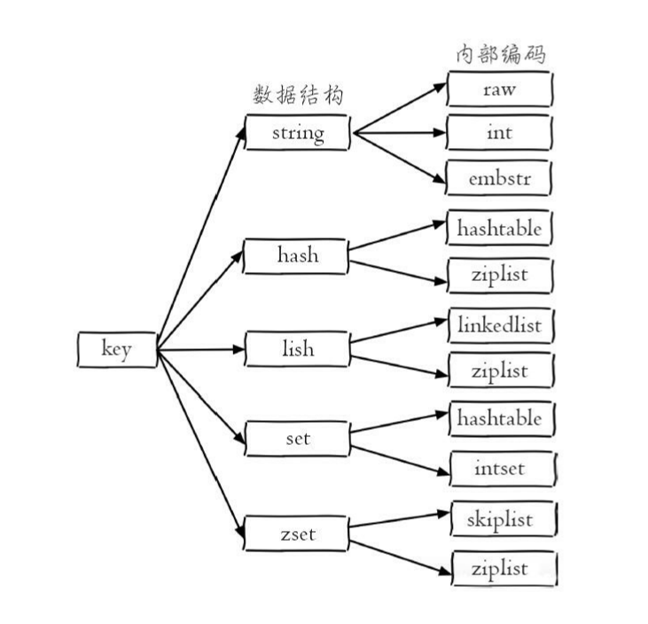

# Redis操作手册

* [官网](https://redis.io)
* redis是单线程事件驱动
* redis没有命名空间概念，可通过`key`的名字自由发挥

## 1 安装

### 1.1 linux上安装

* ubuntu

```bash
$ sudo apt install redis-server
```

配置文件位于：`/etc/redis/redis.conf`


配置文件中放开`requirepass`的注释可以设置密码，有密码时连接要认证`redis-cli -a passwd`


redis默认端口：`6379`


## 2 使用

连接`redis-server`可以使用自带客户端`redis-cli`，或者某种语言的`api`


```bash
$ redis-cli -h
redis-cli 4.0.9

Usage: redis-cli [OPTIONS] [cmd [arg [arg ...]]]
  -h <hostname>      Server hostname (default: 127.0.0.1).
  -p <port>          Server port (default: 6379).
  -s <socket>        Server socket (overrides hostname and port).
  -a <password>      Password to use when connecting to the server.
```

### 2.1 全局命令

直接在`redis-cli`执行可以看到结果：


* 查看所有键 -  `keys *`
  * 输出所有键值对，慎用
* 键总数 - `dbsize`
  * 无需遍历，这是个`O(1)`的操作
* 检查键是否存在 - `exists key`
  * 存在返回1，不存在返回0
* 删除键 - `del key`
  * 通用命令，什么数据类型都可以删，可以跟多个`key`一次删除
  * 返回成功删除的个数，不存在的键不计数
* 设置过期 - `expire key seconds`
  * 设置`seconds`秒后删除`key`，设置成功返回1
  * `ttl key` 返回剩余时间，大于`0`表示声音时间，`-1`表示没设置超时，`-2`键不存在
* 数据类型 - `type key`
  * 返回`key`中的数据类型，不存在返回`none`
  * 数据类型有`string`,`hash`,`list`,`set`,`zset`
* 内部编码 - `object encoding key`
  * 每种数据类型都有多种内部实现方式，查询`key`的内部实现



### 2.2 字符串

* 设置值

  ```txt
  set key value [ex seconds] [px milliseconds] [nx|xx]
  ```

  * `ex seconds` - 选项，设置秒级过期时间
  * `px milliseconds` - 设置毫秒级过期时间
  * `nx` - 键必须不存在，才能设置成功，用于添加
  * `xx` - 键值必须存在，用于更新

* 获取值

  ```txt
  get key
  ```

  * 如果键不存在，返回`nil`

* 批量设置值

  ```cpp
  mset key value [key value ...]
  ```

* 批量获取值

  ```txt
  mget key [key ...]
  ```

  * 如果有些键不存在，值为`nil`

* 计数，增加值(string的实现必须是int),自减

  ```txt
  incr key		 	// +1
  decr key 			// -1
  incrby key n 		// +n
  decrby key n 		// -n
  incrbyfloat key n.m // +n.m 浮点数  内部实现是 embstr
  ```

  * 值不是整数，返回错误
  * 值是整数，返回自增后的结果
  * 键不存在，按照值为0自增

* 追加

  ```txt
  append key value
  ```

  * 向字符串尾部拼接值，返回拼接后长度
  * 如果键不存在，当成向空字符串后拼接

* 获取长度

  ```txt
  strlen key
  ```

  * 键不存在返回0

* 设置并返回原值

  ```txt
  getset key value
  ```

  * 设置新值，把原来的值返回
  * 键不存在，返回`nil`

* 设置指定位置字符

  ```txt
  setrange key offeset value
  ```

  * 把`key`里面的字符串偏移`offeset`的位置的字符设置为`value`
  * 长度超出，填充`0x00`, 键不存在按空串处理

* 获取部分字符串

  ```txt
  getrange key start end
  ```

  * 返会落在范围内的字符，范围大只返回实际有的字符串
  * 键不存在当空串处理，范围多大都返回`""`


#### 2.2.1 内部编码

* `int` - 8字节长整型(有符号)
* `embstr` - 小于等于39个字节的字符串
* `raw` - 大于39个字节的串


### 2.3 哈希

哈希类型是指键值本身又是一个键值对结构


形如`value = { {field1，value1}, ...{fieldn,valuen} }`


* 设置值

  ```txt
  hset key field value
  hset user:1 name kirito
  ```

  * 向键值为`key`的字典中加入一个键值对
  * 成功返回1，否则0
  * 提供了`hsetnx`命令，用于添加

* 获取值

  ```
  hget key field
  ```

  * 不存在返回`nil`

* 删除field

  ```txt
  hdel key field [field ...]
  ```

  * 返回成功删除的个数

* 计算field个数

  ```txt
  hlen key
  ```

  * 不存在返回0，键的内容不是哈希返回错误信息

* 批量设置，获取 field-value

  ```txt
  hmget key field [field ...]
  hmset key field value [field value ...]
  ```

* 判断field是否存在

  ```txt
  hexists key field
  ```

* 获取所有field

  ```txt
  hkeys key
  ```

  * 这个命令应该叫`hfields`更为恰当

* 获取所有value

  ```txt
  hvals key
  ```

* 获取所有的 field-value

  ```txt
  hgetall key
  ```

  * 如果数量多，慎用
  * 如果一定要获取全部field-value，可以使用`hscan`命令

* value自增

  ```txt
  hincrby key field n
  hincrbyfloat key field n.m
  ```

  * 像`incrby`和`incrbyfloat`命令一样，但是它们作用的是filed

* 计算value的字符串长度（3.2版本以上）

  ```txt
  hstrlen key field
  ```

  


#### 2.3.1 内部编码

* `ziplist` - 压缩列表，紧凑的结构实现多个元素的连续存储，所以在节省内
  存方面比hashtable更加优秀，元素少的时候用这个
* `hashtable` - 哈希表


### 2.4 列表

一个列表最多可以存储$2^{32} -1$个元素。可以对列表两端插入（push）和弹出（pop），还可以获取指定范围的元素列表、获取指定索引下标的元素等


| 操作类型 |          操纵          |
| :------: | :--------------------: |
|   添加   | `rpush lpush linsert`  |
|   查询   | `lrange lindex  llen`  |
|   删除   | `lpop rpop lrem ltrim` |
|   修改   |         `lset`         |
| 阻塞操作 |     `blpop brpop`      |

#### 2.4.1 添加操作


