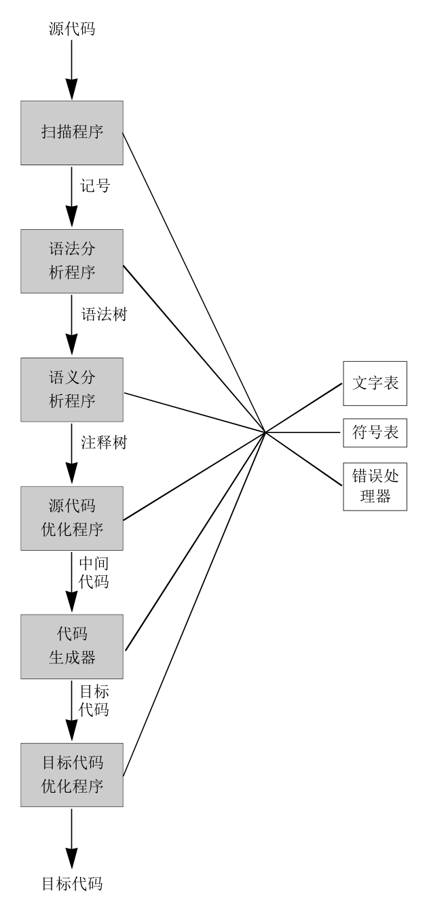

## 编译器结构

主要阶段：

* 词法分析
* 语法分析
* 语义分析
* 代码生成

前端后端

## 参考

* [《编译原理及实践》](https://book.douban.com/subject/6982310/)
* [华保健老师的网易云公开课](https://mooc.study.163.com/learn/1000002001#/learn/announce)
* [陈意云老师的公开课及PPT课件](https://www.bilibili.com/video/BV1RW411v7R7)