## 词法分析(Lexical Analysis)的任务

字符流到记号流

字符流： 和被编译的语言密切相关(ASCII, Unicode, ...)

记号流：编译器内部定义的数据结构，编码所识别出的词法单元

## 词法记号的描述与识别

* 串和语言
  * 字母表：符号的有限集合，例：$\Sigma=\{0,1\}$
  * 串：符号的有穷序列，例：$0110,\varepsilon$
  * 语言：字母表上的一个串集 $\{\varepsilon,0,00,...\},\{\varepsilon \},\varnothing$
  * 句子：属于语言的串
* 串的运算
  * 连接(积) ：$xy,s\varepsilon=\varepsilon s=s$
  * 幂：$s^0为\varepsilon,s^i为s^{i-1}s(i>0)$
* 语言的运算
  * 并：$L\cup M=\{s|s\in L或s\in M\}$
  * 连接：$LM=\{st|s\in L且t\in M\}$
  * 幂：$L^0是\{\varepsilon\},L^i是L^{i-1}L$
  * 闭包：$L^*=L^0\cup L^1\cup L^2\cup...$
  * 正闭包：$L^+=L^1\cup L^2\cup...$

## 正则表达式

**（Regular Expression, RE）**

目的是表达编程语言中词法的规则，从而可以有工具来自动生成词法分析器。

正则表达式表示字符串的格式。正则表达式$ r$完全由它所匹配的串集来定义。这个集合称为由正则表达式生成的语言（language generated by the regular expression），写作L（r）。此处的语言只表示“串的集合”，它与程序设计语言并无特殊关系。

该语言首先依赖于适用的字符集，它一般是 A S C I I字符的集合或它的某个子集。有时该集比 ASCII字符的集合更普通一些，此处集合的元素称作符号（ s y m b o l）。这个正规符号的集合称作字母表（a l p h a b e t）并且常写作希腊符号$\Sigma$（s i g m a）。

对正则表达式命名(正规定义)
$$
d_1\to r_1 \\
d_2\to r_2 \\
...\\
d_n\to r_n
$$

- 各个$d_i$的名字都不同
- 每个$r_i$都是$\Sigma\cup\{d_1,d_2...\}$上的正则表达式

语法糖，和对正则表达式命名一样，用来简化构造，不是必须的，只是方便表示

* $[c_1-c_n]$ 表示$c_1|c_2|...|cn$
* $e+$表示一个或多个$e$
* $e?$表示零个或一个$e$
* $“a*"$表示$a*$自身，不是$a$的闭包
* $e\{i,j\}$表示$i$到$j$个$e$的连接
* $.$ 表示除$'\backslash n'$外所有的任意字符

正规定义的例子：$\Sigma=ASCII$

c语言标识符，以字母下划线开头，后跟0个或多个数字字母下划线
$$
letter\_ \to A|B|...|Z|a|b|...|z|\_  \\
digit \to 0|1|...|9\\
id \to letter\_(letter\_|digit)^*
$$

## 有穷自动机

**finite state automata（FA）**

有穷自动机，是描述特定类型算法的数学方法。特别地，有穷自动机可用作描述在输入串中识别模式的过程，因此也能用作构造扫描程序。当然有穷自动机与正则表达式之间有着很密切的关系。

以上面对c语言标识符的定义举例子，识别过程可以表示为下图

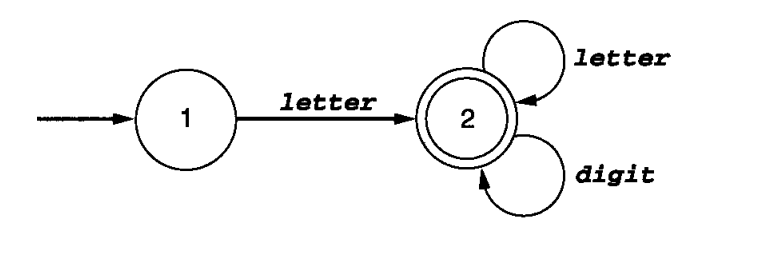

* 圆圈1，2是状态（state）
* 箭头表示状态转换（transition）
* 状态 1是初始状态（start state），由一个不来自任何地方的箭头指向它表示
* 状态 2 是接受状态（ accepting state），两个圆圈表示，可能不止一个

### 非确定有穷自动机

 **(Nondeterministic finite automata, NFA)**

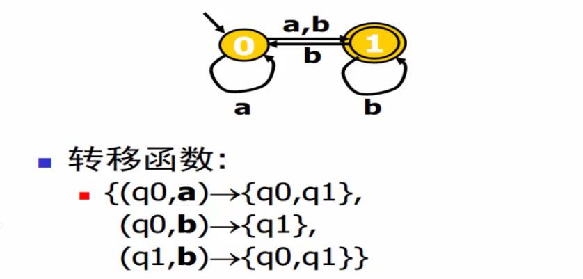

给定字符的状态转移是不确定的，是一个集合，这样的自动机叫非确定有穷自动机。如图，状态0接收到字符a后，可以转换到状态1也可以转换到状态0，目标状态是一个集合，所以是不确定的。

### 确定性有穷自动机

**(Deterministic finite automata, DFA)**

如果状态转移的目标状态都是确定的，而不是一个集合，那么就是确定性有穷状态自动机。c语言标识符哪个例子里的自动机就是确定性的。

词法分析器应该使用DFA，比NFA容易。

## 从RE到NFA

下面将要谈到的结构是 Thompso n结构（Thompson construction），它以其发明者命名。Thompson结构利用$\varepsilon-$转换将正则表达式的机器片段“粘在一起”以构成与整个表达式相对应的机器。

基于对RE的结构做归纳：

* 对于基本的RE直接构造
* 对于复合的RE递归构造

1. 基本正则表达式：基本正则表达式格式 **a** 或 $\varepsilon$  ， **a** 表示字母表中单个字符的匹配，$\varepsilon $是空串的匹配

   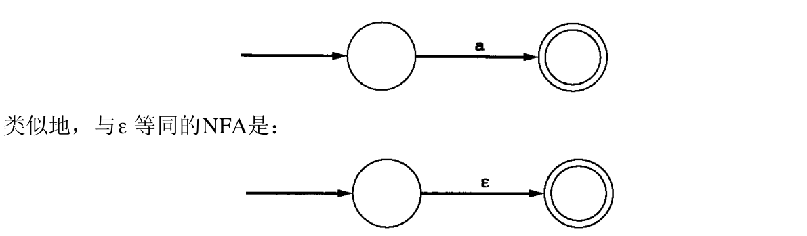

2. 并置：我们希望构造一个与正则表达式 $rs$ 等同的 NFA，其中 $r$ 和 $s$  都是正则表达式。假设已构造好了与 $r$  和 $s$ 等同的 NFA，可将与 $rs$ 对应的 NFA 构造如下：

   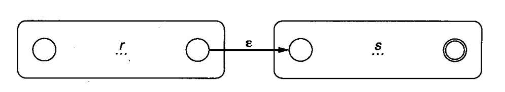

3. 在各项中选择：构造一个与 $ r | s $ 相对应的 NFA

   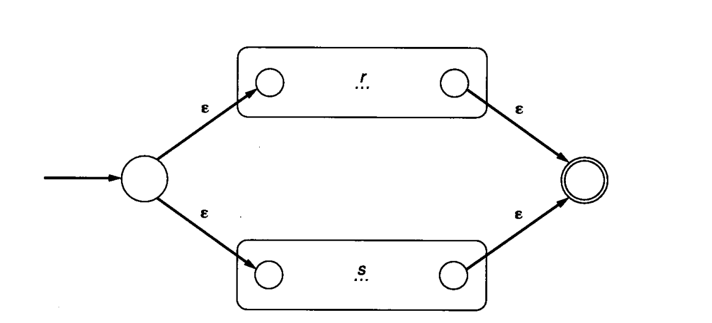

4. 重复：构造与 $r^*$ 相对应的 NFA

   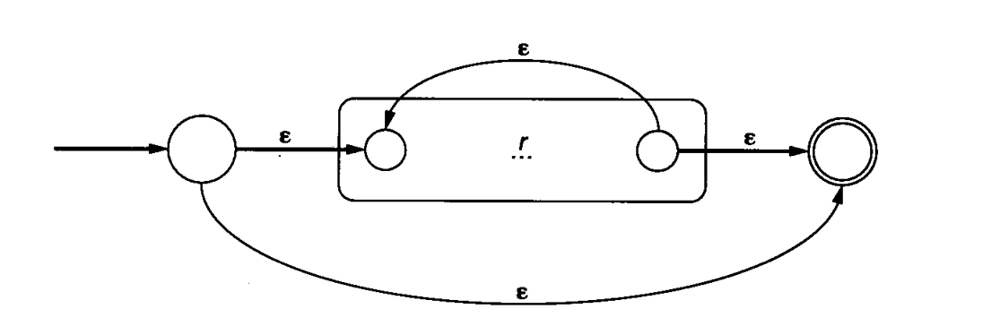

## 从NFA到DFA

子集构造法

对于正则表达式 $a(b|c)^*$ 的NFA

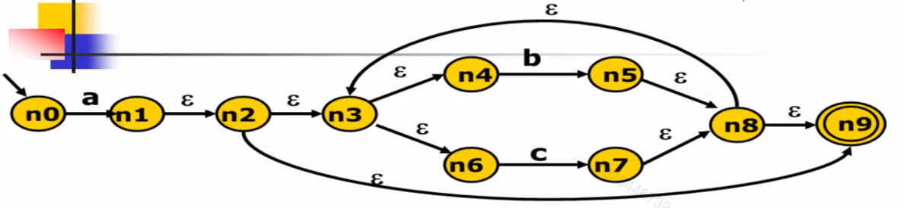

* $n_0$读入$a$，可以转换到 $\{n_1,n_2,n_3,n_4,n_6,n_9\}$，记作 $q_1$  (从$n_1$可以继续沿着$\varepsilon$边走，记录所有可达状态，这个叫$\varepsilon-$闭包)
* $q_1$读入$b$，可以到达$\{n_5,n_8,n_9,n_3,n_4,n_6\}$，记作$q_2$ ，($n_4$可以走到$n_5$，然后加上$n_5$的$\varepsilon-$闭包)
* $q_1$读入$c$，可以到达$\{n_7,n_8,n_9,n_3,n_4,n_6\}$，记作$q_3$ 

* 然后发现从$q_2$ $q_3$ 都可以读入$b$ $c$，最后得到的集合还是$q_2$ $q_3$ 
* 到这里就完成了，所有包含$n_9$的状态都是接受状态，起始状态$q_0=\{n_0\}$，$n_0$没有$\varepsilon$边

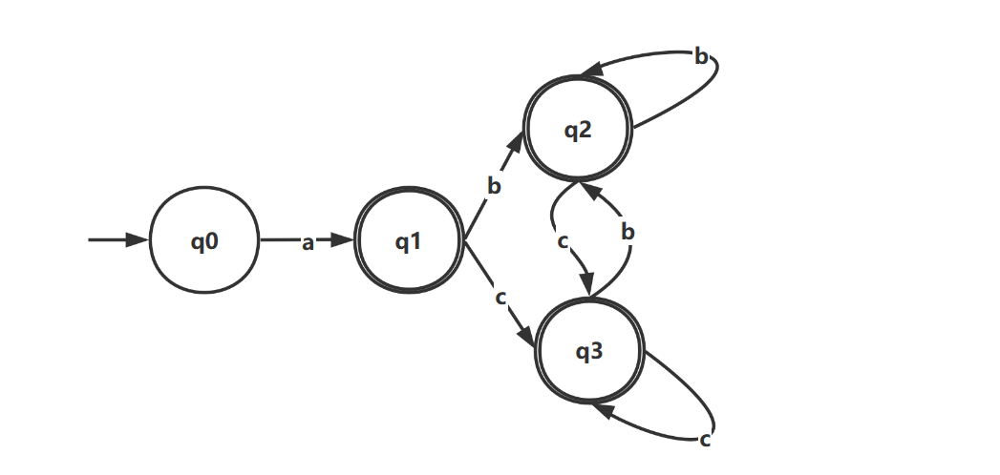

状态集合的 $\varepsilon-$ 闭包：我们将单个状态$s$ 的 $\varepsilon-$ 闭包定义为可由一系列的零个或多个 $\varepsilon-$ 转换
能达到的状态集合，并将这个集合写作$\bar{s}$ 。一个状态的 $\varepsilon-$ 闭包总是包含着该状态本身。

## DFA的最小化

因为在扫描程序中，效率是很重要的，如果可能的话，在某种意义上构造的 DFA 应最小。实际上，自动机理论中有一个很重要的结论，即：对于任何给定的 DFA，都有一个含有最少量状态的等价的DFA，而且这个最小状态的 DFA是唯一的

Hopcroft算法：基于等价类的思想

* 先将所有状态分为两个集合$N$(非接受状态)，$A$(接受状态)
* 对于每个输入，如果集合内的状态接受这个输入转换后，目标状态不在同一个集合，则需要把这个集合划分开，因为他们对于当前输入不等价(目标不一致)
* 重复上一条，直到不可划分，合并同一个集合的状态

例1：对于上面$a(b|c)^*$ 的 DFA

* $N=\{q_0\}$，$A=\{q_1,q_2,q_3\}$
* $N$只有一个状态不能划分，$A$里面所有状态转移都落在$A$集合本身里，所以不能划分
* 合并完只有两个节点了

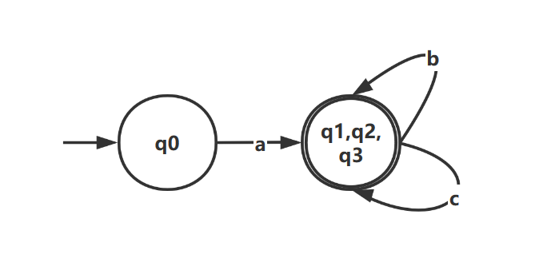

例2：$f(ee|ie)$的DFA

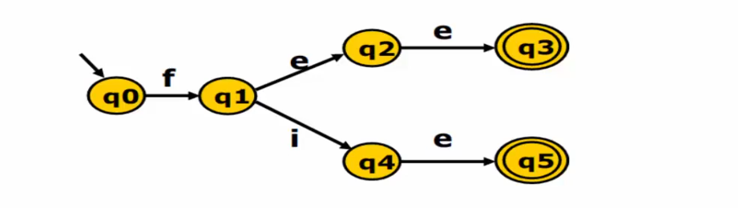

* $N=\{q_0,q_1,q_2,q_4\}$，$A=\{q_3,q_5\}$(不可分)
* $e$可以把集合$N$拆分成两个：$\{q_0,q_1\}$，$\{q_2,q_4\}$，$q_0,q_1$接受$e$后都还在集合$N$，$q_2,q_4$都转换到了$A$(看作他俩等价)
* $\{q_2,q_4\}$(不可分)记作$S$，对于$\{q_0,q_1\}$，$e$可以把他划分为：$\{q_0\}$，$\{q_1\}$ (一个目标在原集合，一个在$S$)
* 全部不可再分，合并

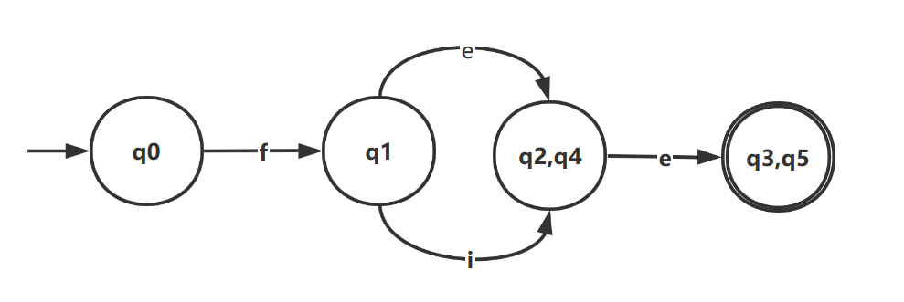

